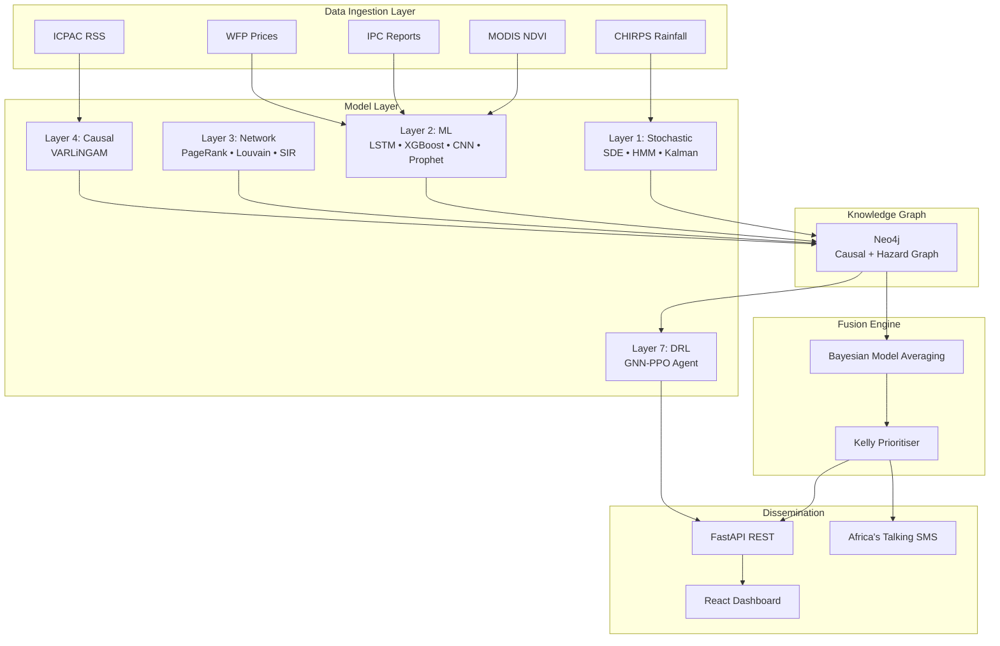
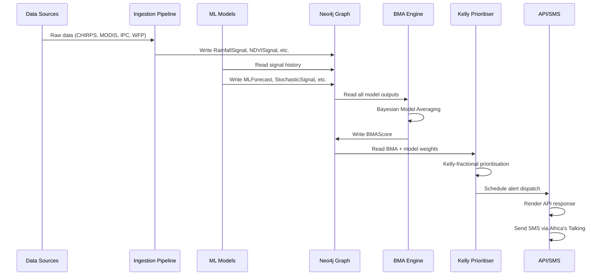
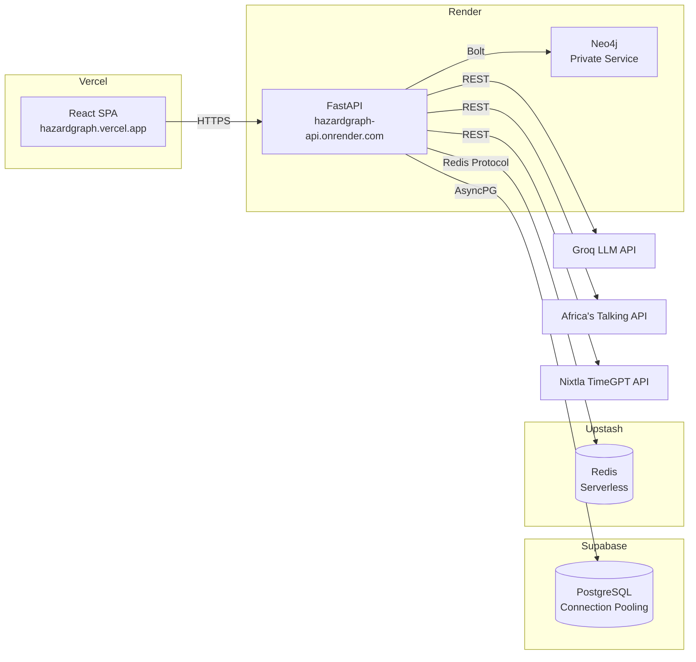
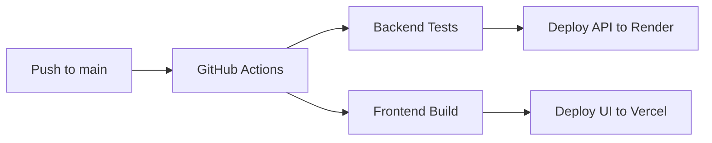

# HazardGraph — Food Security Early Warning System

<div align="center">

**A Quantifaya Climate Intelligence Product**  
*Powered by the GraphAlpha Quantitative Engine*

[](https://github.com/Godwin-88/hazard-graph/actions/workflows/ci-cd.yml)
[](https://fastapi.tiangolo.com)
[](https://neo4j.com)
[](https://reactjs.org)
[](LICENSE)

</div>

---

## Executive Summary

**HazardGraph** is a real-time early warning system that predicts food security crises across the Horn of Africa (IGAD region) up to **12 weeks in advance**. It applies the same quantitative finance machinery used in options pricing and portfolio risk — stochastic processes, Bayesian inference, network science, and deep reinforcement learning — to climate and food security data.

> *"The same graph that prices volatility can price vulnerability."*

### Business Value

| Stakeholder | What HazardGraph Delivers |
|---|---|
| **ICPAC / Humanitarian Coordinators** | 12-week crisis forecasts with 11-model ensemble consensus |
| **NGO Programme Officers** | Aid allocation clusters — group regions by hazard similarity |
| **Early Response Teams** | Optimal alert dispatch via deep RL (GNN-PPO) |
| **Government Agencies** | Contagion cascade simulation — which region to protect first |
| **Pastoralists & Farmers** | SMS alerts in local languages via Africa's Talking |

### Key Differentiators

- **11-model ensemble** — from stochastic SDEs to graph neural networks to foundation models
- **Graph-native** — Neo4j knowledge graph stores all signals, models, and relationships
- **DRL alert dispatch** — GNN-PPO agent learns optimal alert timing to minimise fatigue + maximise impact
- **Zero-shot TimeGPT** — pre-trained foundation model for any climate variable
- **Kelly-optimal prioritisation** — same formula used by professional investors to size bets, now prioritising alerts

---

## Architecture

### System Architecture



### Data Flow



### Deployment Architecture



---

## Quantitative Model Registry

| ID | Model | Category | Technique | Output | Frequency |
|---|---|---|---|---|---|
| M1 | CIR + Jump Diffusion SDE | Stochastic | Mean-reverting jump-diffusion | P(flood/drought 4w) | Weekly |
| M2 | Hidden Markov Model | Statistical | 5-state Gaussian HMM | HazardRegime label | Weekly |
| M3 | Kalman Filter | Filtering | Linear state-space | Smoothed SPI/NDVI | Daily |
| M4 | Bidirectional LSTM | Deep Learning | 2-layer BiLSTM ensemble | P(IPC phase 1-5, 4w) | Weekly |
| M5 | XGBoost + SHAP | ML | Gradient-boosted trees | P(Crisis 8w) + explanation | Weekly |
| M6 | CNN NDVI | Deep Learning | 3-layer Conv2D + GAP | Vegetation stress P | Weekly |
| M7 | Prophet + TimeGPT | Foundation Model | NeuralProphet + Nixtla | 12w forecast + CI | Weekly |
| M8 | VARLiNGAM | Causal | Linear non-Gaussian acyclic | Causal graph edges | Monthly |
| M9 | PageRank | Network Science | Personalised PageRank | Contagion centrality | Weekly |
| M10 | Louvain Community | Network Science | Modularity maximisation | Aid allocation clusters | Monthly |
| M11 | SIR Cascade | Network Science | Monte Carlo contagion | Contagion probability | Weekly |
| M12 | BMA Engine | Ensemble | Bayesian Model Averaging | Posterior risk score | Weekly |
| M13 | Kelly Prioritiser | Decision Theory | Kelly-fractional criterion | Alert dispatch order | On-demand |
| M14 | GNN-PPO | Deep RL | Graph Attention + PPO | Optimal alert dispatch | Weekly |

### Mathematical Formulations

#### M1: CIR + Jump Diffusion SDE (Rainfall)

> *Business meaning: Models rainfall like a stock price with mean reversion and sudden jumps — capturing both gradual droughts and flash floods.*

$$
dR(t) = \kappa(\theta - R(t))dt + \sigma\sqrt{R(t)}dW(t) + J \cdot dN(t)
$$

| Symbol | Meaning | Business Interpretation |
|---|---|---|
| $R(t)$ | Rainfall anomaly (SPI) | How far current rain is from normal |
| $\kappa$ | Mean-reversion speed | How fast weather returns to normal |
| $\theta$ | Long-run mean | Normal rainfall level |
| $\sigma$ | Volatility | How erratic rainfall is |
| $J$ | Jump size | Magnitude of extreme events (ENSO-driven) |
| $N(t)$ | Poisson process | How often extreme events occur |

**Feller condition:** $2\kappa\theta > \sigma^2$ — ensures rainfall stays positive (same condition as interest rate models in finance).

#### M2: Hidden Markov Model (Regime Detection)

> *Business meaning: Automatically detects whether a region is in Drought, Normal, Wet, or Extreme conditions — like a smart thermostat for climate.*

$$
P(S_t | O_{1:t}) = \text{Forward}(\pi, A, B, O_{1:t})
$$

- **Hidden states** $S \in \{\text{Dry}, \text{Normal}, \text{Wet}, \text{ExtremeDry}, \text{ExtremeWet}\}$
- **Observations** $O = [\text{SPI}, \text{NDVI}, \text{FoodPrice}, \text{IPC}]$
- **Transition matrix** $A$: probability of moving between regimes
- **Emission matrix** $B$: probability of observations given a regime

#### M5: XGBoost with SHAP (Food Crisis Prediction)

> *Business meaning: A decision tree that learns from history which combinations of factors lead to food crises, and can explain its reasoning to non-technical stakeholders.*

$$
P(\text{Crisis} \mid \mathbf{x}) = \sigma\left(\sum_{k=1}^{K} f_k(\mathbf{x})\right)
$$

Where $f_k$ are decision trees and $\sigma$ is Platt scaling for calibration.

**SHAP explanation:** Each prediction is decomposed into feature contributions:

$$
f(\mathbf{x}) = \phi_0 + \sum_{j=1}^{M} \phi_j
$$

Where $\phi_j$ is the contribution of feature $j$ (e.g., "SPI_30 contributed +15% to crisis probability").

#### M9: PageRank (Vulnerability Propagation)

> *Business meaning: A region that's moderately at-risk but surrounded by crisis regions is correctly elevated in priority — like how a small bank in a financial crisis is still vulnerable.*

$$
PR(i) = \frac{1-d}{N} + d \sum_{j} \frac{PR(j) \cdot w(j,i)}{\sum_k w(j,k)}
$$

**Systemic risk score:** $\text{SystemicRisk}(i) = PR(i) \times \text{RiskScore}(i) \times \text{Vulnerability}(i)$

#### M12: Bayesian Model Averaging

> *Business meaning: Instead of trusting one model, we average all 11 models weighted by their recent accuracy — like getting a second opinion from 11 experts and weighting each by their track record.*

$$
P(\text{crisis} \mid \text{data}) = \sum_{m=1}^{11} P(\text{crisis} \mid \text{data}, M_m) \times P(M_m \mid \text{data})
$$

**Model weights** (updated weekly via Brier score):

$$
P(M_m \mid \text{data}) \propto \exp\left(-\text{BrierScore}(M_m, \text{last 8 weeks})\right)
$$

#### M13: Kelly Criterion (Alert Prioritisation)

> *Business meaning: The same formula legendary investors use to size their bets — now used to decide which alerts to send first when bandwidth is limited.*

$$
\text{Priority} = \frac{(p \times c) - (1-p)}{p} \times (1 - u)
$$

| Symbol | Meaning |
|---|---|
| $p$ | BMA risk score |
| $c$ | Model confidence (1 - epistemic uncertainty) |
| $u$ | Epistemic uncertainty (model disagreement) |

#### M14: GNN-PPO (Deep Reinforcement Learning)

> *Business meaning: An AI agent that learns through trial and error the optimal timing and targeting of alert dispatches to maximise community response while minimising alert fatigue.*

**Policy objective (clipped PPO):**

$$
L^{\text{CLIP}}(\theta) = \mathbb{E}_t\left[\min\left(r_t(\theta) A_t, \text{clip}(r_t(\theta), 1-\epsilon, 1+\epsilon) A_t\right)\right]
$$

**Reward function:**

$$
R = \text{IPC improvement} \times (+5.0) - \text{alert fatigue} \times (-1.5) - \text{missed alerts} \times (-4.0) - \text{action cost} \times (-0.3)
$$

**Architecture:** Graph Attention Network (GAT) with 4 attention heads, 2 layers, actor-critic output.

---

## Project Structure

```
hazardgraph/
├── main.py                          # FastAPI entry point with lifespan
├── Dockerfile                       # Docker build (Python 3.11 + PyTorch)
├── docker-compose.yml               # Local dev stack (Neo4j + Postgres + Redis + API)
├── render.yaml                      # Render Blueprint (Neo4j + API deployment)
├── requirements.txt                 # Python dependencies
│
├── config/
│   └── settings.py                  # Pydantic BaseSettings (env-var driven)
│
├── db/
│   ├── neo4j_client.py              # Async Neo4j driver singleton
│   ├── postgres_client.py           # AsyncPG engine + session factory
│   └── redis_client.py             # Redis client singleton
│
├── auth/
│   ├── jwt_service.py               # JWT creation, verification, auth deps
│   └── password_service.py          # bcrypt password hashing
│
├── models/
│   ├── stochastic/
│   │   └── rainfall_sde.py          # M1: CIR + Jump Diffusion SDE
│   ├── regime/
│   │   └── climate_hmm.py           # M2: HMM regime detection
│   ├── filtering/
│   │   └── kalman.py                # M3: Kalman filter
│   ├── ml/
│   │   ├── lstm_drought.py          # M4: BiLSTM drought forecaster
│   │   ├── xgb_food_crisis.py       # M5: XGBoost + SHAP
│   │   ├── ndvi_cnn.py              # M6: CNN NDVI anomaly detector
│   │   └── timeseries_ensemble.py   # M7: Prophet + TimeGPT
│   ├── network/
│   │   ├── pagerank_vulnerability.py # M9: PageRank vulnerability
│   │   ├── community_detection.py   # M10: Louvain clustering
│   │   └── contagion_cascade.py     # M11: SIR cascade
│   ├── ensemble/
│   │   ├── bma_engine.py            # M12: Bayesian Model Averaging
│   │   └── kelly_prioritiser.py     # M13: Kelly prioritisation
│   ├── rl/
│   │   ├── graph_state.py           # Graph state dataclass
│   │   ├── gnn_policy.py            # GAT actor-critic network
│   │   ├── alert_env.py             # Gymnasium environment
│   │   ├── ppo_trainer.py           # PPO training loop
│   │   ├── reward_calculator.py     # Reward function
│   │   └── policy_inference.py      # Trained policy inference
│   └── postgres/
│       ├── users.py                 # User model
│       ├── alerts.py                # Alert model
│       ├── risk.py                  # Risk score model
│       └── jobs.py                  # Job run model
│
├── causal/
│   ├── varlingam_engine.py          # M8: VARLiNGAM causal discovery
│   ├── time_series_assembler.py     # Panel data builder
│   └── edge_writer.py               # CausalEdge Neo4j writer
│
├── risk/
│   └── scoring_service.py           # Compound risk scoring service
│
├── ingestion/
│   ├── chirps_fetcher.py            # CHIRPS rainfall data
│   ├── modis_fetcher.py             # MODIS NDVI data
│   ├── ipc_fetcher.py               # IPC phase reports
│   ├── wfp_fetcher.py               # WFP food prices
│   └── icpac_rss_fetcher.py         # ICPAC RSS alerts
│
├── alerts/
│   ├── advisory_generator.py        # Groq LLM advisory generation
│   ├── at_sms_service.py            # Africa's Talking SMS dispatch
│   └── feedback_handler.py          # Inbound SMS feedback
│
├── graph/
│   ├── node_writers.py              # Neo4j node writers
│   ├── schema_validator.py          # Schema validation
│   ├── lineage.py                   # Data lineage tracking
│   └── temporal_snapshots.py        # Weekly graph snapshots
│
├── scheduler/
│   └── jobs.py                      # APScheduler cron jobs (17 total)
│
├── api/
│   ├── deps.py                      # FastAPI dependency injectors
│   └── routers/
│       ├── health.py                # GET /api/v1/health
│       ├── auth.py                  # POST /api/v1/auth/login
│       ├── risk.py                  # GET /api/v1/risk/scores
│       ├── forecast.py              # GET /api/v1/forecast/{model}/{region}
│       ├── alert.py                 # GET/PATCH/POST /api/v1/alerts
│       ├── graph.py                 # GET /api/v1/graph/nodes
│       ├── lineage.py               # GET /api/v1/lineage
│       ├── rl_policy.py             # GET /api/v1/rl/recommendations
│       ├── scenarios.py             # POST /api/v1/scenarios/cascade
│       └── webhooks.py              # POST /api/v1/webhooks/at-*
│
├── hazardgraph-ui/                  # React frontend (Vite + TypeScript)
│   ├── src/
│   │   ├── App.tsx                  # Router config
│   │   ├── pages/
│   │   │   ├── Dashboard.tsx        # Choropleth map + risk overview
│   │   │   ├── AlertReview.tsx      # Alert queue with Kelly scores
│   │   │   ├── GraphExplorer.tsx    # Force-directed graph explorer
│   │   │   ├── Analytics.tsx        # Model weights + time series
│   │   │   ├── ScenarioSimulator.tsx # DRL + Cascade + Clusters
│   │   │   └── Login.tsx            # JWT login
│   │   ├── components/
│   │   │   ├── map/RiskChoropleth.tsx    # Leaflet choropleth
│   │   │   ├── graph/ForceGraph.tsx      # react-force-graph-2d
│   │   │   ├── alerts/AlertQueueItem.tsx # Alert card
│   │   │   └── layout/QuantifayaHeader.tsx # Brand header
│   │   └── lib/api.ts              # API client with auth headers
│   └── vercel.json                 # Vercel SPA config
│
├── tests/
│   ├── test_models.py               # M1-M14 model tests
│   ├── test_rl.py                   # GNN-PPO env + policy tests
│   ├── test_api.py                  # API endpoint tests
│   └── conftest.py                  # Test fixtures (Docker services)
│
├── migrations/
│   └── 001_schema.cypher            # Neo4j schema initialisation
│
├── scripts/
│   ├── init_postgres.sql            # PostgreSQL schema
│   └── seed_demo_data.py            # Demo data seeder
│
├── .github/workflows/
│   └── ci-cd.yml                    # GitHub Actions CI/CD pipeline
│
└── models/saved/                    # Trained model weights (.pt, .pkl)
```

---

## API Endpoints

### Public

| Method | Path | Description | Auth |
|---|---|---|---|
| `GET` | `/` | App info + docs link | None |
| `GET` | `/api/v1/health` | System health (Neo4j, Postgres, Redis, Scheduler) | None |

### Authentication

| Method | Path | Description | Auth |
|---|---|---|---|
| `POST` | `/api/v1/auth/login` | Login → JWT access + refresh tokens | None |
| `POST` | `/api/v1/auth/refresh` | Refresh access token | Bearer |
| `POST` | `/api/v1/auth/register` | Register new user (admin only) | Admin |

### Risk Scores

| Method | Path | Description | Auth |
|---|---|---|---|
| `GET` | `/api/v1/risk/scores` | All region BMA risk scores | Bearer |
| `GET` | `/api/v1/risk/scores/{region}` | Single region score + components | Bearer |
| `GET` | `/api/v1/risk/history/{region}` | 12-week risk history | Bearer |

### Forecasts

| Method | Path | Description | Auth |
|---|---|---|---|
| `GET` | `/api/v1/forecast/lstm/{region}` | LSTM IPC phase forecast | Bearer |
| `GET` | `/api/v1/forecast/xgb/{region}` | XGBoost crisis probability | Bearer |
| `GET` | `/api/v1/forecast/all/{region}` | All models aggregated | Bearer |

### Alerts

| Method | Path | Description | Auth |
|---|---|---|---|
| `GET` | `/api/v1/alerts` | List alerts (paginated, filterable) | Bearer |
| `GET` | `/api/v1/alerts/{id}` | Single alert detail | Bearer |
| `PATCH` | `/api/v1/alerts/{id}` | Approve/reject alert | Officer |
| `POST` | `/api/v1/alerts/{id}/dispatch` | Dispatch via SMS | Officer |
| `GET` | `/api/v1/alerts/{id}/responses` | Y/N responses | Bearer |
| `GET` | `/api/v1/alerts/analytics/uptake` | 30-day uptake analytics | Bearer |
| `POST` | `/api/v1/alerts/generate` | Manual advisory generation | Admin |

### Graph

| Method | Path | Description | Auth |
|---|---|---|---|
| `GET` | `/api/v1/graph/nodes` | All graph nodes + edges | Bearer |
| `GET` | `/api/v1/graph/regimes` | Current regime per region | Bearer |

### DRL Policy

| Method | Path | Description | Auth |
|---|---|---|---|
| `GET` | `/api/v1/rl/recommendations` | GNN-PPO optimal alert actions | Bearer |
| `POST` | `/api/v1/rl/train` | Trigger PPO training (background) | Officer |
| `GET` | `/api/v1/rl/training-status` | Check if trained model exists | Bearer |

### Scenarios

| Method | Path | Description | Auth |
|---|---|---|---|
| `POST` | `/api/v1/scenarios/cascade` | Run SIR cascade simulation | Bearer |
| `GET` | `/api/v1/scenarios/clusters` | Get aid allocation clusters | Bearer |
| `POST` | `/api/v1/scenarios/clusters/refresh` | Re-run Louvain clustering | Officer |
| `GET` | `/api/v1/scenarios/temporal-graph` | Last 12 weekly snapshots | Bearer |

### Data Lineage

| Method | Path | Description | Auth |
|---|---|---|---|
| `GET` | `/api/v1/lineage/region/{id}` | Full data provenance for a region | Admin |

### Webhooks (no auth — AT posts here directly)

| Method | Path | Description |
|---|---|---|
| `POST` | `/api/v1/webhooks/at-delivery` | Africa's Talking delivery report |
| `POST` | `/api/v1/webhooks/at-inbound` | Inbound SMS from farmers |

---

## Quick Start

### Prerequisites

- Docker & Docker Compose v2
- Git
- Node.js 20+ (for frontend development)

### Local Development with Docker

```bash
# 1. Clone the repository
git clone https://github.com/Godwin-88/hazard-graph.git
cd hazardgraph

# 2. Set up environment
cp .env.example .env
# Edit .env with your API keys (Groq, Africa's Talking, etc.)

# 3. Start all services
docker compose up -d

# 4. Check health
curl http://localhost:8000/api/v1/health

# 5. Login to get JWT token
curl -X POST http://localhost:8000/api/v1/auth/login \
  -H "Content-Type: application/json" \
  -d '{"username": "admin", "password": "HazardGraph2026!"}'

# 6. Start frontend (separate terminal)
cd hazardgraph-ui
npm ci
npm run dev
# → http://localhost:5173
```

### Running Tests

```bash
# Start test infrastructure
docker compose -f docker-compose.test.yml up -d

# Run model tests
pytest tests/test_models.py -v

# Run RL tests
pytest tests/test_rl.py -v

# Run all tests
pytest tests/ -v
```

### Testing API Endpoints

```bash
# Get auth token
TOKEN=$(curl -s -X POST http://localhost:8000/api/v1/auth/login \
  -H "Content-Type: application/json" \
  -d '{"username": "admin", "password": "HazardGraph2026!"}' \
  | jq -r '.access_token')

# Risk scores
curl -H "Authorization: Bearer $TOKEN" \
  http://localhost:8000/api/v1/risk/scores

# DRL recommendations
curl -H "Authorization: Bearer $TOKEN" \
  http://localhost:8000/api/v1/rl/recommendations

# Cascade simulation
curl -X POST -H "Authorization: Bearer $TOKEN" \
  -H "Content-Type: application/json" \
  -d '{"source_region": "somalia", "horizon_weeks": 8}' \
  http://localhost:8000/api/v1/scenarios/cascade

# Aid clusters
curl -H "Authorization: Bearer $TOKEN" \
  http://localhost:8000/api/v1/scenarios/clusters
```

---

## CI/CD Pipeline

The project uses **GitHub Actions** for continuous integration and deployment:



### Secrets Required

| Secret | Description |
|---|---|
| `VERCEL_TOKEN` | Vercel API token |
| `VERCEL_ORG_ID` | Vercel organisation ID |
| `VERCEL_PROJECT_ID` | Vercel project ID |
| `RENDER_API_KEY` | Render API key |
| `RENDER_API_SERVICE_ID` | Render service ID |

### Deployment Architecture

| Service | Provider | Purpose |
|---|---|---|
| **Frontend** | [Vercel](https://vercel.com) | React SPA at `hazardgraph.vercel.app` |
| **Backend API** | [Render](https://render.com) | FastAPI + Uvicorn Web Service |
| **Neo4j** | Render (Docker) | Graph database (private service) |
| **PostgreSQL** | [Supabase](https://supabase.com) | Managed Postgres with PgBouncer |
| **Redis** | [Upstash](https://upstash.com) | Serverless Redis for caching + rate limiting |
| **CI/CD** | [GitHub Actions](https://github.com/features/actions) | Automated test + deploy pipeline |

---

## External Services

| Service | Purpose | Free Tier |
|---|---|---|
| [Groq](https://groq.com) | LLM advisory generation (Mixtral 8x7B, Llama 3.3) | 30 req/min |
| [Africa's Talking](https://africastalking.com) | SMS dispatch to 11 countries | 100 SMS free |
| [Nixtla TimeGPT](https://nixtla.io) | Zero-shot time series forecasting | 5,000 calls/month |
| [NASA Earthdata](https://earthdata.nasa.gov) | MODIS NDVI satellite imagery | Free |
| [CHIRPS](https://www.chc.ucsb.edu/data/chirps) | Rainfall data (1981–present) | Free |
| [WFP API](https://data.api.wfp.org) | Food price data | Free |

---

## Scheduler (APScheduler)

The system runs **17 cron jobs** weekly for automated ML inference:

| Time (UTC) | Job | Description |
|---|---|---|
| Mon 06:00 | `fetch_chirps` | Download latest CHIRPS rainfall |
| Mon 06:15 | `fetch_icpac` | Fetch ICPAC RSS alerts |
| Mon 06:25 | `fetch_wfp` | Download WFP food prices |
| Mon 06:35 | `run_sde` | M1: CIR + Jump Diffusion |
| Mon 06:40 | `run_hmms` | M2: HMM regime detection |
| Mon 06:45 | `run_lstm` | M4: LSTM drought forecast |
| Mon 06:45 | `run_xgb` | M5: XGBoost food crisis |
| Mon 06:50 | `run_cnn_ndvi` | M6: CNN NDVI anomaly |
| Mon 07:05 | `run_timegpt` | M7: Prophet + TimeGPT |
| Mon 07:10 | `run_pagerank` | M9: PageRank vulnerability |
| Mon 07:20 | `run_sir_cascade` | M11: SIR cascade |
| Mon 07:30 | `run_scoring` | Compound risk scoring |
| Mon 07:35 | `run_bma` | M12: Bayesian Model Averaging |
| Mon 07:45 | `run_advisories` | LLM advisory generation |
| Mon 08:00 | `run_dag` | AsyncIO DAG pipeline executor |
| 1st of month 00:00 | `run_louvain` | M10: Community detection |
| 1st of month 01:00 | `run_ppo_training` | M14: GNN-PPO training |
| Sun 20:00 | `save_graph_snapshot` | Weekly graph state snapshot |

---

## Model Performance

Each model's performance is tracked in the `model_performance` PostgreSQL table using **Brier score** (lower is better):

$$
\text{Brier} = \frac{1}{N} \sum_{t=1}^{N} (f_t - o_t)^2
$$

Where $f_t$ is the forecast probability and $o_t$ is the actual outcome (0 or 1).

Model weights in the BMA engine are updated weekly based on the rolling 8-week Brier score.

---

## Brand & Design

HazardGraph is a **Quantifaya** product. The design system uses:

- **Font:** Raleway (300, 400, 600, 700)
- **Primary:** `#0F4C81` (Quantifaya deep blue)
- **Accent:** `#00C896` (Quantifaya green)
- **Dark mode:** `#0A0F1E` background

---

## License

MIT — see [LICENSE](LICENSE)

---

## Author

**Godwin Edgar Opuka** — Quantifaya  
*"The same graph that prices volatility can price vulnerability."*

---

<div align="center">
  <sub>Built for the IGAD Hackathon 2026 | Powered by the GraphAlpha Quantitative Engine</sub>
</div>